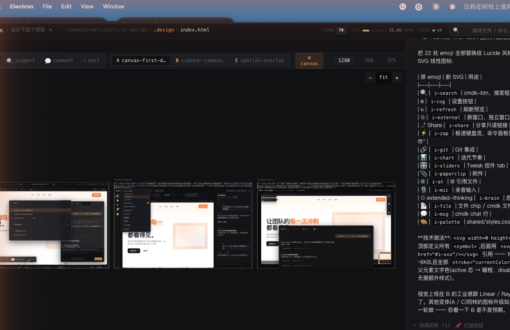

<div align="center">

# Open Design Studio

**Local-first AI design workbench — pair an AI designer with any code repo.**

**本地优先的 AI 设计工作台 — 把 AI 设计师挂到任何代码仓库上。**

[English](#english) · [中文](#中文)



</div>

---

## English

### What is Open Design Studio?

Open Design Studio is a desktop app that pairs an AI designer with your codebase. Point it at any local folder; the AI drafts real HTML / CSS / JS designs into a sandboxed `.design/` subdirectory inside that folder. You compare multi-variant prototypes side-by-side on an infinite canvas, inspect any element, drag the canvas like Figma, and edit text inline.

Your project's source code is never touched. AI's design output lives in `.design/` — gitignore-friendly, isolated, exportable as a static zip with one click.

```
your-repo/
├─ src/           ← your code, never touched
├─ package.json
└─ .design/       ← AI designs land here
   ├─ shared/
   │  └─ styles.css
   └─ variants/
      ├─ sidebar-led/index.html
      ├─ canvas-first-dock/index.html
      └─ spatial-overlay/index.html
```

### Why Open Design Studio?

| Tool | Gap |
|---|---|
| **Figma** | Powerful but disconnected from code. AI plug-ins output throwaway mockups, not real markup. |
| **Cursor / Claude Code** | Great for code, no design workflow. No side-by-side variant comparison. No inspect mode. |
| **ChatGPT / Claude.ai** | One chat, one output, no canvas, no iteration discipline. |

Open Design Studio = **Figma's canvas & variant discipline + Claude Code's depth in code + local privacy**.

### Features

- 🎨 **AI as designer** — Claude Opus / GPT writes real HTML/CSS, you see it render in real time
- 🔀 **Multi-variant canvas** — 3 directions side-by-side (conservative / balanced / bold), pan & zoom like Figma
- 📁 **Bind a local folder** — AI writes to disk; your VSCode edits sync back into the chat
- 🔍 **Inspect / Comment / Edit** — point at any element, leave a comment, or edit text inline
- 🎛 **Tweak controls** — AI marks tweakable points in source; drag a slider / color picker to update the file in place
- ⌘K **Command palette** — fuzzy jump to file / chat / project / action, keyboard-driven
- 🛠 **Real coding tools** — `read_file` (with `cat -n` line numbers), `search_files` (grep + glob), `apply_patch` (multi-file atomic), `todo_write`
- 🧠 **Smart context** — auto-elide old / large tool results; file-hash dedup on re-reads; saves ~$1/turn on Opus
- 💾 **Local secrets** — API keys live in OS keychain (macOS Keychain / Win DPAPI / Linux libsecret), never in browser storage
- 🔒 **Code isolation** — AI's outputs live in `.design/`, your source code is read-only to the AI

### Quick start

```bash
git clone https://github.com/<you>/open-design-studio
cd open-design-studio
pnpm install
pnpm electron:dev
```

Then:
1. Bottom-left **⚙ Settings** → paste your Anthropic / OpenAI key (saved to OS keychain)
2. Left rail **📂 Projects → ＋ New project** → pick any local folder
3. Type in the right-side chat: *"Make me a SaaS landing page, 3 directions"*
4. Watch three variants land in `<your-folder>/.design/variants/`

Recommended model: **Anthropic Claude Opus 4.x** via Anthropic API or compatible gateway. Output budget defaults to 128k tokens (Opus's hard ceiling) so even dense one-shot pages fit.

### Examples

See [`docs/examples/`](docs/examples/) for sample `.design/` outputs you can browse without running anything. Each folder is a complete multi-variant project — drop one into your own project's `.design/` and Open Design Studio will pick it up immediately.

Notably: `docs/examples/dogfooding-workbench-redesign/` shows the 3 variants we generated when redesigning this very tool's UI. Variant A (`sidebar-companion`) is what shipped.

### Architecture (60 seconds)

```
Electron app
┌─────────────────────────────────────────────────────────────┐
│  TopBar (project · breadcrumb · turn / tokens / autosave)   │
├──┬─────────────────────────────────────┬───────────────────┤
│  │  canvas-frame                       │                   │
│Rl│   ↕ multi-variant canvas (Figma)    │   ChatPane        │
│56│      + inspect / comment / edit     │   (with TodoPanel │
│  │      + Tweak controls               │    + tool blocks  │
│  ├─────────────────────────────────────┤    + ask_questions│
│  │  VariantBar (A · B · C chips)       │    streaming)     │
├──┴─────────────────────────────────────┴───────────────────┤
│  StatusBar (git · turn · ctx · model · zoom · ⌘K)            │
└────────────────────────────────────────────────────────────┘

Renderer process              Main process (embedded Hono)
- React UI                    - LLM provider (Anthropic / OpenAI)
- Dexie (chat history)        - File system (read/write in .design)
- Service Worker preview      - Chokidar file watcher
- Element bridge / inject     - Git status (read-only)
                              - Keytar (API keys → OS keychain)
```

**Two file scopes**:
- **`.design/`** — AI's sandbox: write_file / edit_file / apply_patch / read_file all scoped here
- **project root** — read-only for the AI via `list_source_files` / `read_source_file` / `search_files`. AI uses these in Phase 1 Recon to understand your stack; never writes here.

### Tech stack

- **Electron** for native shell (cross-platform, full Chromium for design-fidelity rendering)
- **React 18** + **Vite** renderer
- **Hono** + `@hono/node-server` for the embedded LLM server (in-process, auth via Bearer token)
- **Anthropic SDK** + **OpenAI SDK** for upstream calls, normalized to one `Block[]` schema
- **Dexie** (IndexedDB) for chat history, messages, snapshots
- **Chokidar** for file watching, **simple-git** for status, **keytar** for OS keychain
- **TypeScript strict** throughout

### Status & roadmap

- **v6.x (current)** — Electron + native folder binding + multi-variant canvas + workbench layout
- Next: shell-tool execution, LSP-aware reads, MCP server support
- See `PLAN_ELECTRON.md` for the engineering roadmap

### License

MIT

---

## 中文

### Open Design Studio 是什么?

Open Design Studio 是一个桌面 AI 设计工作台。把它绑到本地任何一个文件夹,AI 会把生成的设计稿(真实的 HTML / CSS / JS)写到该文件夹下的 `.design/` 子目录里 —— **跟你的原代码完全隔离**。你能在无限画布上**并排对比多个变体方案**,点选元素 inspect,拖动画布像 Figma,内联直改文字。

```
你的项目/
├─ src/           ← 你的代码,AI 一根毛都不动
├─ package.json
└─ .design/       ← AI 生成的设计在这里
   ├─ shared/
   │  └─ styles.css
   └─ variants/
      ├─ sidebar-led/index.html
      ├─ canvas-first-dock/index.html
      └─ spatial-overlay/index.html
```

`.design/` 可以加进 `.gitignore`,也可以跟代码一起 commit。一键导出 zip 给同事看。

### 为什么是 Open Design Studio?

| 工具 | 现存痛点 |
|---|---|
| **Figma** | 设计强但跟代码脱节;AI 插件出来的 mockup 又落不到真 token / 真组件 |
| **Cursor / Claude Code** | 能写代码但没设计工作流;没**多变体并排对比**,没 inspect 模式 |
| **ChatGPT / Claude 官方版** | 单 chat 单输出,没 canvas,没"多方向"纪律 |

Open Design Studio = **Figma 的画布感与变体纪律 + Claude Code 的代码深度 + 本地化的隐私和速度**。

### 功能特性

- 🎨 **AI 当设计师** — Claude Opus / GPT 写真 HTML/CSS,iframe 实时渲染
- 🔀 **多变体画布** — 同一需求出 3 个方向(保守 / 中位 / 大胆),无限画布并排对比,Figma 一样 pan/zoom
- 📁 **绑本地文件夹** — AI 写真文件落到磁盘;你在 VSCode 里改,chat 知道你改了什么
- 🔍 **Inspect / Comment / Edit** — 点元素 inspect、留评论、直改文案
- 🎛 **Tweak 控件** — AI 在源码里标 marker,你拉滑块 / 选颜色就能改值,**源文件同步更新**
- ⌘K **命令面板** — 模糊跳转文件 / chat / 项目 / 命令,键盘流不离手
- 🛠 **真正的写代码工具集** — `read_file`(带 `cat -n` 行号)、`search_files`(grep + glob)、`apply_patch`(多文件原子化)、`todo_write`
- 🧠 **智能上下文压缩** — 自动 elide 老的 / 大的 tool result;同 path + 同 hash 重读直接 stub。Opus 单 turn 省 ~ $1
- 💾 **API key 进系统钥匙串** — macOS Keychain / Win DPAPI / Linux libsecret,不存浏览器
- 🔒 **代码隔离** — AI 写永远只在 `.design/`,原项目代码只读

### 快速开始

```bash
git clone https://github.com/<你>/open-design-studio
cd open-design-studio
pnpm install
pnpm electron:dev
```

然后:
1. 左下 **⚙ 设置** → 粘你的 Anthropic / OpenAI key(自动存系统钥匙串)
2. 左 rail **📂 项目 → ＋ 新建项目** → 选本地任意文件夹
3. 右边 chat 里输入:**"做一个 SaaS 落地页,3 个方向"**
4. 看 `<你的文件夹>/.design/variants/` 下出现三个变体

推荐用 **Anthropic Claude Opus 4.x**(Anthropic 官方 API 或兼容网关均可)。输出预算默认 128k tokens(Opus 硬上限),一次性写超密度页面也兜得住。

### 示例

[`docs/examples/`](docs/examples/) 下有 AI 设计输出的真实样例,不用跑代码也能浏览。每个子目录是一个完整的多变体项目 —— 拷到你自己项目的 `.design/` 下,Open Design Studio 立刻识别并展示。

特别注意:`docs/examples/dogfooding-workbench-redesign/` 是**我们用这个工具自己设计自己**生成的 3 个变体方案,最终发布版选了变体 A(`sidebar-companion`)。

### 30 秒看架构

```
Electron App
┌────────────────────────────────────────────────────────────┐
│  顶 TopBar  (项目 · 文件 breadcrumb · turn / tokens / 保存) │
├──┬────────────────────────────────────┬──────────────────┤
│  │  canvas-frame                      │                  │
│Rl│   ↕ 多变体画布(Figma 风)          │   ChatPane       │
│56│      + inspect / comment / edit    │   (含 TodoPanel  │
│  │      + Tweak 控件                  │    + tool 调用块  │
│  ├────────────────────────────────────┤    + ask_questions│
│  │  VariantBar (A · B · C 变体 chips) │     流式)         │
├──┴────────────────────────────────────┴──────────────────┤
│  底 StatusBar  (git · turn · ctx · model · zoom · ⌘K)      │
└────────────────────────────────────────────────────────────┘

Renderer 进程                Main 进程(嵌入式 Hono)
- React UI                   - LLM provider (Anthropic / OpenAI)
- Dexie 存 chat 历史          - 文件系统(.design/ 读写)
- 预览 SW + iframe 注入       - Chokidar 文件 watcher
- elementBridge / inspect    - Git 状态(只读)
                             - Keytar(API key → 系统钥匙串)
```

**两个文件命名空间**:
- **`.design/`** — AI 的沙箱:`write_file` / `edit_file` / `apply_patch` / `read_file` 全在这里
- **项目根** — 对 AI 只读:`list_source_files` / `read_source_file` / `search_files` 拿到上下文(技术栈、现有 token、组件风格),但**不能写**

### 技术栈

- **Electron** 桌面壳(跨平台,Chromium 渲染保证设计还原度)
- **React 18** + **Vite** renderer
- **Hono** + `@hono/node-server` 嵌入式 LLM 后端(同进程,Bearer token 鉴权)
- **Anthropic SDK** + **OpenAI SDK** 调上游,归一化为统一 `Block[]` schema
- **Dexie**(IndexedDB)存 chat / messages / snapshots
- **Chokidar** 文件监听、**simple-git** git 状态、**keytar** 系统钥匙串
- **TypeScript strict** 全栈

### 状态 & 路线

- **v6.x(当前)** — Electron 套壳 + 本地文件夹绑定 + 多变体画布 + workbench 布局
- 接下来:shell 工具执行、LSP-aware 读源码、MCP server 接入
- 详细路线见仓库 `PLAN_ELECTRON.md`

### 协议

MIT
